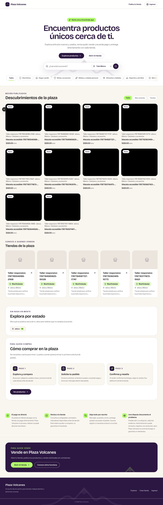
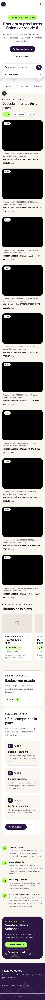
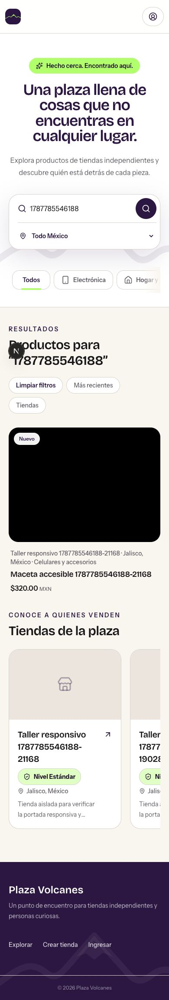

# Plaza Volcanes landing-page audit

Date: 2026-08-26  
Scope: baseline logged-in landing page plus signed-out follow-up at desktop, 390 px mobile, 320 px compact mobile, and product search.
Goal: help shoppers understand the marketplace, trust sellers, and reach a relevant product quickly.

## Baseline verdict

Strong brand foundation; not world class yet. Overall: **5.8/10**.

Main constraint is marketplace credibility, not visual style. Page looks intentional, but only two products, two shops, one missing product image, repeated imagery, weak seller evidence, and long buyer journey make the experience feel like a polished prototype.

## Landing release control

The repository-local [Marketplace content-readiness gate](content-readiness.md) is the release checklist for this audit. It is currently blocked; do not treat the landing as launch-ready until its production evidence requirements are complete.

## Follow-up audit — 2026-08-26

### Verdict

The responsive, conversion, trust-copy, image-fallback, and accessibility implementation is materially stronger. The follow-up score is **7.4/10**, up from 5.8/10. The release is still **blocked**, because production inventory, imagery, copy quality, and merchandising variety have not been inspected or evidenced. The 8/10 overall target and the target of no category below 7/10 are therefore not met.

The four screenshots below show ten accumulated synthetic E2E fixture records with black test images and generated test names. They verify layout and interaction states only. They are not production catalog content and are not evidence that the marketplace content-readiness gate passed.

### Follow-up flow evidence

#### Step 1 — Populated desktop home at 1440 px: healthy implementation, release-blocked content

The hero now explains the buyer proposition and offers direct browse and seller actions. Products lead the page, shop cards expose stored location and the platform-computed tier, buyer education precedes a compact seller pitch, and the direct-payment/dispute limits are stated without an unsupported protection or verification claim. The ten uniform black thumbnails belong to accumulated synthetic E2E records, so this capture cannot validate production image quality or merchandise variety.

#### Step 2 — Populated mobile home at 390 px: healthy

Search, the state selector, category navigation, products, shops, buyer guidance, risk copy, and the compact seller call to action remain available in a single-column flow. The header and controls stay within the viewport. The long capture reflects ten accumulated synthetic E2E records stacked on mobile; it does not establish the density or quality of a production catalog.

#### Step 3 — Populated compact home at 320 px: healthy

The prior 66 px document overflow is resolved. Compact account treatment fits, search retains the state selector, and horizontally scrollable category/shop rows do not widen the document. The full browser gate also verifies visible, unclipped keyboard focus at this width.

#### Step 4 — Filtered search at 390 px: healthy

The query remains visible, the selected location remains available, the result heading communicates the filtered state, and exactly one matching synthetic E2E record is shown. Current in-app-browser DOM inspection confirmed the expected landmark, heading, and control structure in this state; the current console check contained no errors or warnings.

### Follow-up scorecard

| Area | Baseline | Follow-up | Evidence and remaining constraint |
|---|---:|---:|---|
| Brand and visual direction | 8/10 | **8/10** | The existing purple/lime system remains coherent across all four captures. |
| Value-proposition clarity | 6/10 | **8/10** | The populated hero now says what buyers can find and that payment/delivery are agreed directly with each shop. |
| Merchandising | 3/10 | **4/10** | The layout now handles a denser populated catalog, but production inventory, imagery, mix, and copy remain unverified. Local fixture content cannot raise this to launch quality. |
| Trust and reassurance | 5/10 | **7/10** | Stored location, platform-computed tier, direct-payment risk, written-record guidance, and dispute limits are visible without invented metrics or guarantees. Production evidence remains unverified. |
| Buyer conversion | 5/10 | **8/10** | Browse and seller actions are clear, products lead the page, seller education is compact, and filtered search reaches a relevant result. |
| Mobile responsiveness | 5/10 | **9/10** | 320/390 px captures and browser assertions show no document overflow, retained discovery controls, and usable horizontal scrollers. |
| Accessibility readiness | 6/10 | **8/10** | Current DOM and E2E structure, keyboard, target-size, image-fallback, and 320/390/1440 reflow checks are strong; native assistive-technology and device checks remain unperformed. |

Arithmetic mean: **7.4/10**. This is an implementation-quality improvement, not a launch-readiness pass.

### Release and diagnostic evidence

Fresh release gates from this follow-up:

- `npm run typecheck`: exit 0.
- `npm run lint`: exit 0.
- `npx vitest run --exclude '.worktrees/**'`: 86 test files passed, 500 tests passed, 0 failed.
- `npm run test:e2e`: 6 tests passed, 0 failed, covering the full browser suite.

Current Task 9 follow-up evidence used to support the score:

- Four fresh screenshots captured and inspected in the user-selected in-app browser: populated home at 1440, 390, and 320 px plus the 390 px filtered state.
- Fresh in-app-browser DOM evidence for the expected landmarks, headings, controls, and filtered one-result state.
- Fresh in-app-browser console check with no errors or warnings.
- Current full E2E results above for responsive structure, keyboard flow, target sizes, image fallback, and document-width behavior.

No alternate browser was used to replace the user-selected in-app-browser captures, DOM snapshot, or console check. The required full E2E suite used its configured runner.

Historical Task 8 diagnostic context only — not rerun for Task 9 and explicitly excluded from support for the current follow-up score:

- Lighthouse mobile accessibility, best practices, SEO, and agentic scores: 100 each.
- Automated diagnostic checks: 55 passed, 0 failed.
- Accessibility-tree inspection: landmark, heading, name, and order structure clean.
- In-app browser DOM: expected landmark, heading, and control structure, including the filtered one-result state.
- Browser console: no errors or warnings.
- 1280-to-640 CSS-pixel zoom proxy: no horizontal overflow or lost key content.
- Active-animation inspection: zero active animations.

The historical Task 8 diagnostics above are retained only for chronology. They did not raise or validate any current follow-up score. Neither the current nor historical results prove WCAG conformance or substitute for native VoiceOver traversal, browser-native 200% zoom, OS reduced-motion testing, or physical-device touch testing; none of those four checks was performed.

### Target disposition

| Target | Result |
|---|---|
| No score below 7/10 | **Not met** — merchandising is 4/10 while production content is unverified. |
| Mobile responsiveness at least 8/10 | **Met** — 9/10. |
| Buyer conversion at least 8/10 | **Met** — 8/10. |
| Overall at least 8/10 | **Not met** — 7.4/10. |
| Content-readiness gate complete | **Not met / blocked**. |
| No unsupported protection or verification claim | **Met in the audited implementation and fixture states**. |

### Remaining blockers, owners, and completion criteria

| Status | Finding / dependency | Owner | Completion criteria |
|---|---|---|---|
| **Release blocker** | Production inventory minimum is not evidenced. | Unassigned | Record production read-only evidence of 24–40 published MX products, 8–12 public MX shops, at least 4 populated root categories, and at least 3 represented Mexican states. |
| **Release blocker** | Production listing completeness, image quality, copy normalization, and first-row merchandising mix are unverified. | Unassigned | Audit every published listing for required metadata and a loadable primary image; resolve unrelated image reuse; review visible copy; then capture representative 1440 px and 390 px production rows. |
| Verification gap | Native accessibility and resilience checks remain unperformed. | Unassigned | Record native VoiceOver traversal, browser-native 200% zoom, OS reduced-motion, and physical-device touch results. These are required before claiming full manual accessibility coverage, not proof of production content readiness. |
| Deferred engineering hygiene | Local E2E runs leave uniquely named isolated fixture records. | Unassigned | Add safe local-only teardown that removes only the run-owned fixture account, shop, product, and upload without weakening test isolation. |
| Deferred P2 dependency | Ratings, orders, response time, fulfillment, or similar trust metrics lack mature data and review. | Unassigned | Create the separate batched Supabase plan only after real transaction volume supports minimum sample thresholds and legal/product review; omit signals until then. |

The detailed production thresholds and reproducible local evidence remain in the [Marketplace content-readiness gate](content-readiness.md). No production data, listing status, or storage object was changed during this follow-up.

## Baseline evidence

### Step 1 — Desktop landing page: needs work

Strengths: distinctive purple/lime system, clear hero hierarchy, well-labeled search, memorable local-marketplace position, and coherent section styling.

Risks: sparse product grid creates large dead space; broken/missing imagery damages trust; seller acquisition dominates buyer conversion; trust claims are not shown on product/store cards; secondary copy is too small; total page is long for the amount of useful inventory.

### Step 2 — Mobile first impression at 390 px: mixed

Strengths: hero reflows cleanly, search remains prominent, primary controls reach 44–48 px, and visual identity survives mobile.

Risks: state selector disappears even though local discovery is core; horizontal category row lacks a strong overflow cue; header is crowded; buyer process remains buried below a very large seller section.

### Step 3 — Search result: healthy core behavior, weak result presentation

Search for “Motorola” returns the correct product and preserves query/filter context. Sparse result count and minimal supporting evidence still make the result feel thin. Black circular overlay is Next.js development tooling, not production UI.

### Step 4 — Compact mobile at 320 px: broken

Document width is 386 px inside a 320 px viewport: 66 px horizontal overflow. Header navigation and logout control extend off-screen. Search placeholder clips and category row begins with a hard crop. This fails compact-mobile and zoom-resilience expectations.

## Baseline scorecard

| Area | Score | Why |
|---|---:|---|
| Brand and visual direction | 8/10 | Ownable palette, typography, tone, and component language |
| Value-proposition clarity | 6/10 | Emotion clear; marketplace mechanics and differentiation vague |
| Merchandising | 3/10 | Too little inventory, missing imagery, weak variety and density |
| Trust and reassurance | 5/10 | Strong claims; little visible seller proof at decision points |
| Buyer conversion | 5/10 | Search works; buyer path buried and calls to action weak |
| Mobile responsiveness | 5/10 | Good at 390 px; broken at 320 px; location filter removed |
| Accessibility readiness | 6/10 | Good semantic regions and labels; compact overflow, unnamed mobile logout, small targets/text remain |

## Baseline highest-impact changes

### P0 — Make marketplace feel real

1. Launch landing state only with complete images and enough credible variety: 24–40 products, 8–12 shops, several categories and states.
2. Remove or quarantine listings with missing primary images. Add image-quality standards and intentional fallbacks.
3. Put evidence on cards: seller verification/tier, location, rating/review count, response time, completed orders, pickup/shipping signal. Only show verified data.
4. Rewrite seller bios and listing titles for spelling, accents, consistency, and trust.

### P0 — Rebuild buyer hierarchy

Recommended order: hero/search → live products → trusted shops → how buying works → trust/dispute explanation → compact seller CTA.

At baseline, the seller section occupied the visual climax while buyer education appeared near the end. Cut landing-page height 30–40% and keep detailed seller tiers on a dedicated seller page.

### P0 — Fix compact mobile

1. Replace header link row with compact menu/account treatment below 400 px.
2. Keep every essential action inside viewport; remove 66 px document overflow.
3. Preserve state/location filtering on mobile, perhaps as a filter button or search-sheet control.
4. Add edge fade or partial next chip to signal horizontal category scrolling.

### P1 — Sharpen proposition and conversion

Use a specific hero promise: what users find, where, and why this marketplace is safer or more useful. Add visible primary action for browsing nearby products and secondary action for selling. Keep search examples grounded in actual inventory.

Product cards should answer before click: What is it? How much? Where is it? Who sells it? Why trust them? Can it ship or be picked up?

### P1 — Turn trust copy into proof

Explain direct-payment risk plainly. Clarify what arbitration can and cannot remedy when Plaza Volcanes does not hold funds. Surface verification and order-history proof beside listings, not only in explanatory sections. Add real platform metrics only after enough volume exists.

### P1 — Accessibility pass

1. Give mobile logout button a stable accessible name.
2. Raise footer links and small segmented controls to at least 44 px touch height.
3. Increase 12 px low-opacity tier copy; verify contrast against purple surfaces.
4. Test keyboard focus, 200% zoom, reduced motion, screen reader names/order, image alternatives, and search/filter announcements.

## Baseline evidence limits

Audit used local development data and visible/DOM evidence. It does not prove production performance, analytics conversion, cross-browser behavior, full keyboard support, or WCAG compliance. Keyboard focus could not be verified reliably through current browser-control surface. Next.js development overlay was ignored.
