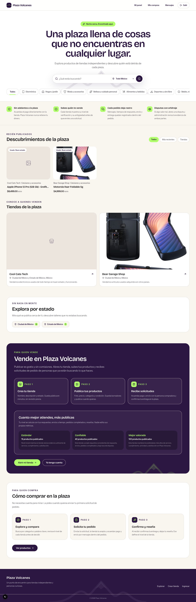
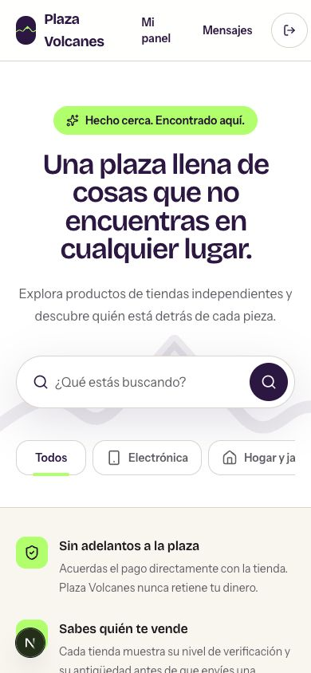
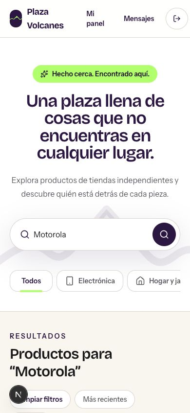
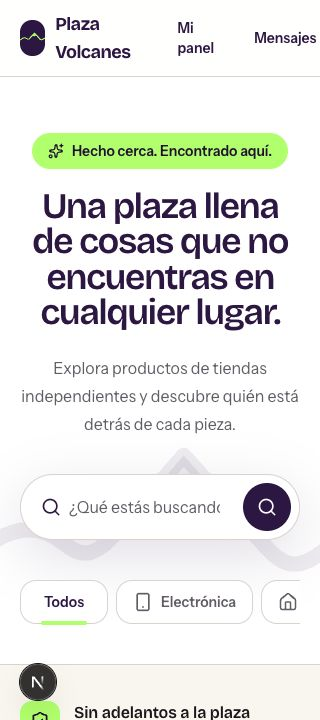

# Plaza Volcanes landing-page audit

Date: 2026-08-26  
Scope: logged-in landing page at desktop, 390 px mobile, 320 px compact mobile, and product search.  
Goal: help shoppers understand the marketplace, trust sellers, and reach a relevant product quickly.

## Verdict

Strong brand foundation; not world class yet. Overall: **5.8/10**.

Main constraint is marketplace credibility, not visual style. Page looks intentional, but only two products, two shops, one missing product image, repeated imagery, weak seller evidence, and long buyer journey make the experience feel like a polished prototype.

## Evidence

### Step 1 — Desktop landing page: needs work

Strengths: distinctive purple/lime system, clear hero hierarchy, well-labeled search, memorable local-marketplace position, and coherent section styling.

Risks: sparse product grid creates large dead space; broken/missing imagery damages trust; seller acquisition dominates buyer conversion; trust claims are not shown on product/store cards; secondary copy is too small; total page is long for the amount of useful inventory.

### Step 2 — Mobile first impression at 390 px: mixed

Strengths: hero reflows cleanly, search remains prominent, primary controls reach 44–48 px, and visual identity survives mobile.

Risks: state selector disappears even though local discovery is core; horizontal category row lacks a strong overflow cue; header is crowded; buyer process remains buried below a very large seller section.

### Step 3 — Search result: healthy core behavior, weak result presentation

Search for “Motorola” returns the correct product and preserves query/filter context. Sparse result count and minimal supporting evidence still make the result feel thin. Black circular overlay is Next.js development tooling, not production UI.

### Step 4 — Compact mobile at 320 px: broken

Document width is 386 px inside a 320 px viewport: 66 px horizontal overflow. Header navigation and logout control extend off-screen. Search placeholder clips and category row begins with a hard crop. This fails compact-mobile and zoom-resilience expectations.

## Scorecard

| Area | Score | Why |
|---|---:|---|
| Brand and visual direction | 8/10 | Ownable palette, typography, tone, and component language |
| Value-proposition clarity | 6/10 | Emotion clear; marketplace mechanics and differentiation vague |
| Merchandising | 3/10 | Too little inventory, missing imagery, weak variety and density |
| Trust and reassurance | 5/10 | Strong claims; little visible seller proof at decision points |
| Buyer conversion | 5/10 | Search works; buyer path buried and calls to action weak |
| Mobile responsiveness | 5/10 | Good at 390 px; broken at 320 px; location filter removed |
| Accessibility readiness | 6/10 | Good semantic regions and labels; compact overflow, unnamed mobile logout, small targets/text remain |

## Highest-impact changes

### P0 — Make marketplace feel real

1. Launch landing state only with complete images and enough credible variety: 24–40 products, 8–12 shops, several categories and states.
2. Remove or quarantine listings with missing primary images. Add image-quality standards and intentional fallbacks.
3. Put evidence on cards: seller verification/tier, location, rating/review count, response time, completed orders, pickup/shipping signal. Only show verified data.
4. Rewrite seller bios and listing titles for spelling, accents, consistency, and trust.

### P0 — Rebuild buyer hierarchy

Recommended order: hero/search → live products → trusted shops → how buying works → trust/dispute explanation → compact seller CTA.

Current seller section occupies the visual climax while buyer education appears near the end. Cut landing-page height 30–40% and keep detailed seller tiers on a dedicated seller page.

### P0 — Fix compact mobile

1. Replace header link row with compact menu/account treatment below 400 px.
2. Keep every essential action inside viewport; remove 66 px document overflow.
3. Preserve state/location filtering on mobile, perhaps as a filter button or search-sheet control.
4. Add edge fade or partial next chip to signal horizontal category scrolling.

### P1 — Sharpen proposition and conversion

Use a specific hero promise: what users find, where, and why this marketplace is safer or more useful. Add visible primary action for browsing nearby products and secondary action for selling. Keep search examples grounded in actual inventory.

Product cards should answer before click: What is it? How much? Where is it? Who sells it? Why trust them? Can it ship or be picked up?

### P1 — Turn trust copy into proof

Explain direct-payment risk plainly. Clarify what arbitration can and cannot remedy when Plaza Volcanes does not hold funds. Surface verification and order-history proof beside listings, not only in explanatory sections. Add real platform metrics only after enough volume exists.

### P1 — Accessibility pass

1. Give mobile logout button a stable accessible name.
2. Raise footer links and small segmented controls to at least 44 px touch height.
3. Increase 12 px low-opacity tier copy; verify contrast against purple surfaces.
4. Test keyboard focus, 200% zoom, reduced motion, screen reader names/order, image alternatives, and search/filter announcements.

## Evidence limits

Audit used local development data and visible/DOM evidence. It does not prove production performance, analytics conversion, cross-browser behavior, full keyboard support, or WCAG compliance. Keyboard focus could not be verified reliably through current browser-control surface. Next.js development overlay was ignored.
